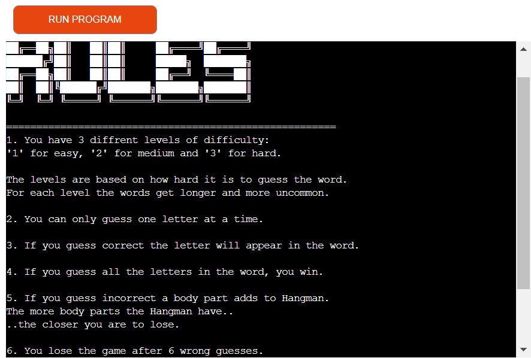

# Hangman game

[Link to live site]

The Hangman game is a Python terminal game deployed to Heroku. The goal of this game is to guess the secret word with one letter at a time. If the player guess it's wrong to many times the man hangs. If the player guess the word the man survives.

## User Experience

### User Goals
As a user I want:
- First of all to have a simple fun game and be challenged. (The user get's challenged with diffrent levels of difficulty and randomised words at every round.)
- Secondly, to learn how to play and understand the game. (The user get's to understand the game if they read the rules.)
- To play the game without any issues. (If an invalid input occurs the player get's to know what is wrong with an error message.)
- To easily navigate through available options and have clear feedback on my inputs. (The user get's direct feedback when guessing a letter correct or wrong.)
- To know if I won the game or not and what the secret word was. (The user get's feedback if the won or lose when the game is over. They also get's to know what the secret word was.)

### Project Goals
As a programmer of the game, I want the user to meet their goals (above). I also want the game to run smoothly with no bugs.

## Flowchart
I was using a Flowchart to plan out how the code should work. My thoughts while doing this was:
- How should the game start?
- Where should it be inputs from the user?
- How do I deal with incorrect input?

## Headings
I used graphics from [Fancy text pro](https://www.fancytextpro.com/) to make the welcome and game rules headings.

## Features
### Existing features
* Start of the game
    * Welcomes the player.
    * Ask's to enter the player's name.
    * Ask's if the player want's to read the rules.

* Game rules
    * Explains how to play the game.
    * Explains the rules of the game.
    * When scrolling down in the terminal, the player get's asked to choose level of difficulty. From 1-3, "1" is easy, "2" is medium and "3" is hard.

* The game starts
    * The hangman is displayed.
    * The word is hidden by "_" for every secret letter.
    * Under the hidden word the letters guessed shows up. 
    * The user get's to guess letters until they finish the word or until they or out of their 6 chances of guessing wrong and the hangman is hangd. 

* The player wins/loses
    * The player get's to know the secret word. 
    * The player get's asked if they want to play again.
    * If they want to play again it takes them to the beginning of the game.
    * If they dont want to play again a "Thank your for playing!" message shows up.

 

### Future Features
 * Ability to guess whole words if player thinks they know the answer.
 * A highscore board

## Testing
### Manual testing
I been testing the code many times by my own in the local terminal and in the mock terminal on the deployed site Heroku.
- Tried to put invalid input.
- Navigated through the whole game while trying out diffrent of options.
My family and my mentor [Oluwaseun Owonikoko](https://github.com/seunkoko) have also been testing it.
### Automated testing
I used my schools (Code Institute) own validator https://pep8ci.herokuapp.com/. I tested run.py, words.py, word_art.py and hangman_stages.py and the code had no errors or warnings in it.

